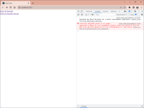
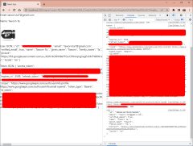
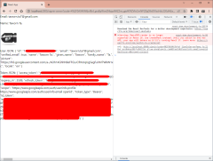

# เขียน Web เพื่อติดต่อกับ Google Sign-in สำหรับ Back-end Server

สำหรับวันนี้ จะเขียน Google Sign-in ในแบบที่เป็น Back-end Server นะครับ

เริ่มต้น ถ้ายังไม่ได้อ่าน [เขียน Web เพื่อติดต่อกับ Google Sign-in ใน 3 ขั้นตอน](../littlegoo/littlegoo.md) ก็ขอให้อ่าน Article บทนั้นก่อน จะได้เข้าใจมากขึ้น และขอข้ามสิ่งที่พูด(พิมพ์)ไปแล้วนะครับ

ส่วนการเขียน Code ก็จะใช้ไฟล์ใน [littlegoo](../littlegoo/littlegoo.md) เป็นจุดเริ่มต้นครับ

----------

## ขั้นแรก: เพิ่ม Redirect URI ใน Google Console

เปิด [Google Console](https://console.cloud.google.com) แล้วเลือก Project เป็น littlegoo

จากนั้นเลือก Menu => Credentials => CREATE CREDENTIALS => OAuth client ID เพิ่มค่า Authorized redirect URIs: http://localhost:3000/signin-server อย่าลืม SAVE ด้วยนะครับ

----------

## ขั้นต่อมา: เพิ่ม Link ไป Google อีกที่

กำหนดว่าเวปเรา จะมี Page เพิ่มขึ้นมาอีก 1 เพจ ใน App.js ตามนี้ครับ

	import { BrowserRouter, Routes, Route } from 'react-router-dom';
	import HomePage from './HomePage';
	import SignInPage from './SignInPage';
	import SignInServerPage from './SignInServerPage';

	export default function App() {
		return (
			<BrowserRouter>
				<Routes>
					{/* หน้าแรก */}
					<Route path="/" element={<HomePage />} />

					{/* หน้ารับ code จาก Google */}
					<Route path="signin" element={<SignInPage />} />

					{/* หน้ารับ code จาก Google และส่งไปที่ server อีกที */}
					<Route path="signin-server" element={<SignInServerPage />} />
				</Routes>
			</BrowserRouter>
		);
	}

----------

ไฟล์ Settings.js ก็ต้องเพิ่มเช่นกัน

	signInServer: () => `https://accounts.google.com/o/oauth2/v2/auth`
		+ `?redirect_uri=http://localhost:3000/signin-server`
		+ `&client_id=${Settings.clientId}`
		+ `&access_type=offline&response_type=code&prompt=consent`
		+ `&scope=${Settings.scope.join(' ')}`,

----------

ไฟล์ HomePage.js นี่ เพิ่มอีก 1 Link ครับ ตามข้างล่างครับ

	import { Settings } from './Settings';

	export default function HomePage() {
		return (
			

				
<a href={Settings.signIn()}>Sign-in Google</a>

				
<a href={Settings.signInServer()}>Sign-in Google Server</a>

			

		);
	}

----------

ไฟล์ที่เพิ่มเข้ามา SignInServerPage.js เป็นไฟล์ไว้ยิง Service ที่เราจะทำเองต่อไป แต่ Code Client ตามข้างล่างนี้ครับ

	// ตอนเริ่ม page
	useEffect(() => {
		if (!done) {
			setDone(true);

			// ยิง service ของเราเอง
			const uri = `http://localhost:8080/signin${window.location.search}`;
			const options = {
				method: 'GET',
			};

			fetch(uri, options).then((res) => {
				if (res.status === 200) {
					res.json().then((json) => {
						setData(json);
					});
				}
			});
		}
	}, [done]);

----------

## สร้าง Server ด้วย Node

เป็น Web Server ง่ายๆ ไม่มีอะไรซับซ้อนครับ มีแค่ 3 ไฟล์ที่เราเขียน เริ่มต้นสร้าง Directory ขึ้นมา ผมใช้ชื่อว่า littlegoo_server แต่คุณจะใช้ชื่อก็อะไรก็ได้ จากนั้นรันคำสั่ง:

	mkdir [directory ที่สร้าง]
	cd [directory ที่สร้าง]
	npm init -y

เราต้องการ library อยู่หลายตัว เรียงเลยครับ

	npm i express
	npm i express-async-handler
	npm i cors
	npm i node-fetch
	npm i query-string

จากนั้นแก้ไขเล็กน้อย ตามนี้ครับ

	{
		"name": "littlegoo_server",
		"version": "1.0.0",
		"description": "the Littlegoo server",
		"main": "./src/index.js",
		"scripts": {
			"start": "node ./src"
		},
		"keywords": [],
		"dependencies": {
			"cors": "^2.8.5",
			"express": "^4.17.1",
			"express-async-handler": "^1.1.4",
			"node-fetch": "^2.6.1",
			"query-string": "^7.1.1"
		}
	}

----------

จากนั้นสร้างไฟล์ src/index.js, มี Directory 'src' นำหน้านะครับ

	'use strict';
	const cors = require('cors');
	const express = require('express');
	const app = express();

	// add modules to express
	app.use(express.json());
	app.use(express.urlencoded({ extended: true }));
	app.use(cors());
	app.use('/signin', require('./signin'));

	// listen to port
	const port = 8080;
	app.listen(port, () => console.log(`server listening on port: ${port}`));

ก็เป็นการจัดการ express และเส้นทาง [server]/signin ให้ไปที่ไฟล์ signin.js ครับ

----------

ส่วน signin.js ส่วนใหญ่เป็น Code เหมือน Client เลยครับ ต่างกันเล็กน้อยเท่านั้น

อ่านค่า Code จาก Query String

	const { code } = req.query;
	console.log(`code: ${code}`);

ยิง Service เพื่อขอค่า Token โดยส่ง Code ที่มากับ Query String พร้อม Parameters อื่นๆ

	let token;
	{
		const uri = `https://oauth2.googleapis.com/token`;
		const options = {
			method: 'POST',
			headers: {
				'Content-Type': 'application/x-www-form-urlencoded',
			},
			body: queryString.stringify({
				code,
				client_id: GOOGLE_CLIENT_ID,
				client_secret: GOOGLE_CLIENT_SECRET,
				redirect_uri: redirectUri,
				grant_type: 'authorization_code',
			}),
		};

		... handle error ...
	}

จากนั้นใช้ Token ที่ได้มา ยิง Service เพื่อขอค่า User Information

	let user;
	{
		const uri = `https://www.googleapis.com/oauth2/v1/userinfo?alt=json&access_token=${token.access_token}`;
		const options = {
			method: 'GET',
			headers: {
				'Authorization': `Bearer ${token.id_token}`,
			},
		};

		... handle error ...
	}

สุดท้าย Return ค่ากลับไป Client

	res.status(200).send({
		token,
		user,
	});

รันโปรแกรม ทั้งบน Server และ Client คำสั่งเดียวกัน แต่คนละ Directory

	npm start

หมายเหตุ: ถ้า npm start เกิด Error เกี่ยวกับ Module และ Import ลอง

- ลบไฟล์ package-lock.json
- npm i  # ติดตั้ง modules ทั้งหมดใหม่

คุณจะได้ Server ประมาณนี้

	> littlegoo_server@1.0.0 start
	> node ./src

	server listening on port: 8080

และ Browser ตามรูปที่ 1

ผลลัพธ์จะเหมือนกัน แต่ต่างกันที่ Client หรือ Server ครับ

รูปที่ 2: ผลลัพธ์จาก Client

รูปที่ 3: ผลลัพธ์จาก Server

----------

## สรุป

การใช้ Google Sign-in ต่อกับหลังบ้าน จะทำให้เราทำอะไรได้มากขึ้น เช่น:

- สร้าง User Record ใน Database ของเราได้
- เอา Google Profile Icon มาแทนรูป Default เวลาสมัคร

สวัสดี

Attachment: https://github.com/taworn-ta7/articles.google.signin-server.git

